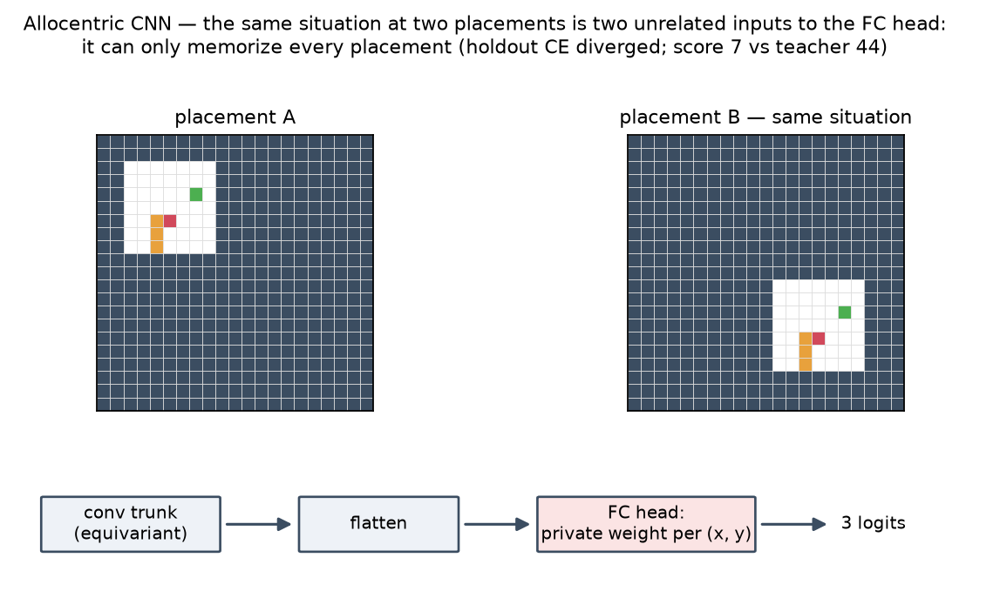
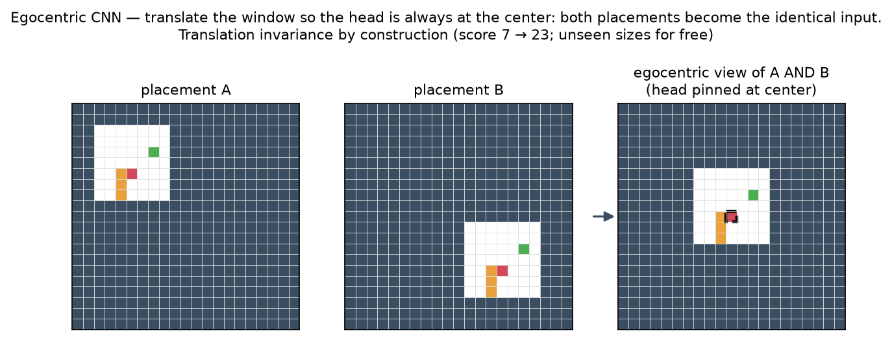
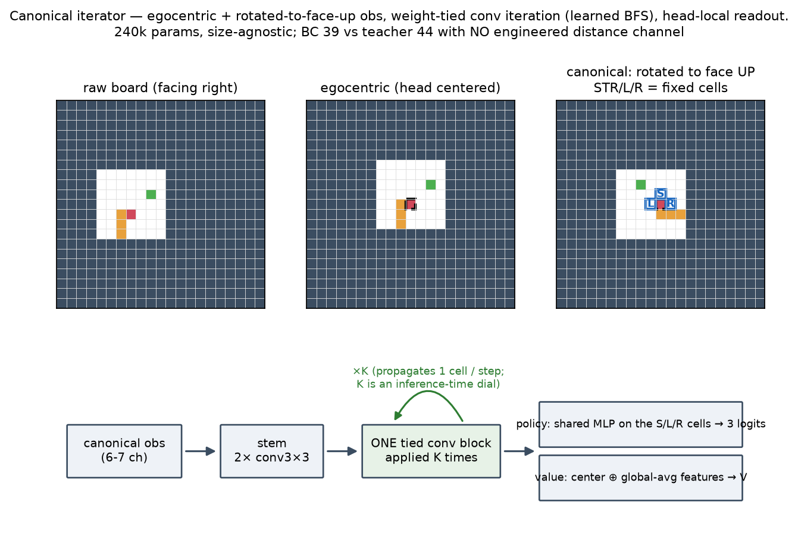

# Snake RL — pixel-based PPO on QBasic Nibbles

Reinforcement-learning experiments on a faithful Python port of
**QBASIC NIBBLES.BAS** (Microsoft, 1990). The plan mirrors the
[../digger-rl](../digger-rl) project's recipe: build pixel-only agents
with PPO + a heuristic teacher for BC bootstrap, learning the lessons
from that project (pixel-from-scratch PPO is hopeless; BC anchor is
the lever).

The eventual goal is to swap the Python sim out for the *real*
nibbles.bas running inside DOSBox-Pure via the libretro binding from
digger-rl. Until then, the Python sim lets us iterate fast.

## TL;DR scoreboard

| Approach | Mean ep score | Notes |
|---|---:|---|
| BFS heuristic teacher | **2100** | 5 eps, level 40+, never game-overs in 20k steps |
| Pixel BC + 1 DAGGER iter (run01) | **-47** | 15k warmup + 15k DAGGER on 84×84 RGB (area downscale). Train acc 81% but eval mean -47; snake invisible after area-interp blurs 2×2 cells to sub-pixel. |
| Pixel BC + 1 DAGGER iter (run02) | **-46** | Same as run01 but obs_size=168 + nearest downscale. Train acc 88%, much sharper probabilities. Snake plays first 15-20 steps perfectly with >0.95 confidence, then degrades after body grows long. Late-game routing is the open problem. |
| Pixel BC + 1 DAGGER iter (run03) | **-50** | Same as run02 but with the `NibblesEnv` seed-diversity bug fixed (every reset now draws a fresh game seed). Train acc 87% (down from 90% — fitting more diverse data is harder). Eval went WORSE: never ate, all 5 lives lost from random navigation. The previous runs were memorizing one specific trajectory; diversity exposed lack of generalization. |
| Symbolic BC + 1 DAGGER iter (run04) | **-49** | Same hyperparams as run03 but feeding the (5, 50, 80) one-hot symbolic obs (cell-type grid: empty/wall/body/head/number) through a small NatureCNN (477k params). Train acc 76%, eval no better than pixel. Probing shows the model picks UP when the number is literally one cell to the right of the head — encoder gets the spatial info in its receptive field but BC over 40k samples doesn't teach navigation. **The bottleneck is BC's data appetite, not the obs encoding.** |
| Tiny-snake + plain BC (run05) | **+3** | New 12x12 textbook snake env with 3-action relative space (STRAIGHT/LEFT/RIGHT) — no NOOP, no reverse-direction ambiguity. Symbolic (5, 12, 12) one-hot in, 3 logits out. 10k warmup + 5k DAGGER, 4.78M params. Big leap: student actually eats food (0-7 per episode), vs teacher ~31. The win was env simplification + 3-action space, not network architecture. |
| Tiny-snake + MC-credit BC (run06) | **+4** | Same as run05 but each training sample weighted by `next_positive_reward / steps_to_event` (user's "retroactive uniform credit"). Min score 2 (vs 0 for plain) — fewer zero-eat episodes. Modest gain on top of plain BC. |
| Tiny-snake + smaller net (runs 07-09) | **0-1** | Tried encoder_width=0.5 (1.2M params) and stride-2 conv downsampling (1.24M params). Both collapse to the modal-class policy (always STRAIGHT). MC-weighted CE is sparse enough that ~1.2M params lacks the redundancy to learn navigation under noisy gradients. **Empirically the 4.78M FC is the right size for this task at this data scale.** |
| Tiny-snake + discounted MC (run10) | **0** | Variant where credit = sum γ^k r — produces negative weights for death-leading trajectories; weighted CE then **anti-imitates** the teacher at those samples. Blew up (CE→-7.4, immediate-death policy). uniform-pos's "deaths get zero weight" is the correct shape. |
| **Tiny-snake + PPO + BC anchor (ppo01)** | **8.2** | Loaded the run06 BC checkpoint, ran PPO for 200k steps with `--bc-anchor-coef 0.5` (extra CE on teacher's action mixed into each PPO minibatch). **2× over BC** — first time RL's reward signal beats the BC ceiling. Peak eval mean 10.1 at update 775, final 8.2 (10-ep eval is noisy). KL stayed ~0.001, anchor CE ~0.1: BC anchor + small clip kept the policy close to teacher behavior while reward shaping pulled it higher. |
| **Tiny-snake + PPO, anneal anchor 0.5→0 (ppo02)** | **10.6** | Same as ppo01 but `--bc-anchor-final 0.0`: BC weight decays linearly to zero by training end. Best final result — the policy starts anchored to teacher behavior, then PPO is free to push past it. Peak mean 11.0 at update 700. |
| Tiny-snake + PPO, ent_coef=0.05 (ppo03) | 10.0 | Same as ppo01 but 5× the entropy bonus. **Highest peak** (mean 11.9 at update 675) but noisier — extra exploration finds better basins but doesn't stay there. Would pair well with a `--save-best` checkpoint sweep. |
| Tiny-snake + PPO from scratch, width=0.25 (ppo04) | 1.4 | 78k-param agent, no BC init, ent_coef=0.05, 300k steps. Final eval 1.4 (max 3). Cannot learn navigation from cold PPO at this capacity — but one episode survived 409 steps with 0 food, so it *did* find a "don't die" local optimum. Confirms the small-network finding from runs 07-09 holds even with reward signal: the BC checkpoint is doing the heavy lifting in ppo01-03. |
| Tiny-snake + micro CNN (15k) plain BC (run11) | **+4** | Hand-picked minimal CNN: 5→8→16→32 conv with stride 1/2/2 + 32-d FC = ~15.5k params. Plain CE (no MC weighting) + 100k teacher samples + 30 epochs + 1 DAGGER iter. **Matches the 4.78M-param baseline at 310× fewer parameters.** Lesson: under plain CE the model size doesn't matter much; under MC-weighted CE small nets collapse to modal class. |
| Tiny-snake + micro CNN + dist-feature (run12) | **+5** | Same recipe but the obs is augmented with a 6th channel: BFS distance from each cell to the food, normalized `d / 144`. Train acc up 88.5%→89.9%, eval mean 4→5. The distance channel helps but barely — at the head's neighbors distances differ by ~1, so normalization to `[0,1]` makes them only ~0.007 apart, which the encoder struggles to discriminate. |
| Tiny-snake + micro CNN + potential field (run13) | **0** | Distance encoding swapped to `exp(-d/4)` potential field — much more spread (neighbor potentials differ by ~0.18 instead of ~0.007). Train acc climbed to 94.5% but **eval crashed to mean 0** with many 500-step truncations. The model learned to wander without dying. Probing the initial state shows it picks TURN_RIGHT with logit 13.35 (very confident) when the food is up-right — confidently wrong in the direction *opposite* the gradient. Hypothesis: the potential field is mostly 0 across the board, so the model latches onto a 0-background-→-safe-action heuristic and ignores the gradient near food. |
| **Tiny-snake + PPO on top of run12 dist-BC (ppo05)** | **6.1** | BC-init PPO with the 6-channel dist-feature obs, micro CNN, 300k steps, BC anchor annealed 0.5→0.05, entropy 0.02→0.005. Fixes: truncation-aware GAE (bootstrap V(terminal_obs) instead of zeroing on `--env-max-steps` cutoff); dist-feature threaded end-to-end so PPO doesn't re-derive credit assignment. Eval 50 eps mean 6.14 median 6 max 14, vs teacher run12 5.3. Training-time peak eval was 7.7 (upd 1000). The base for the specialist runs below. |
| Tiny-snake + greedy specialist (ppo06_greedy) | **8.0** | Init from ppo05, 200k steps, `--reward-eat 5 --reward-die -1 --vf-coef 0.02`: bigger food payout, small vf coef to keep value loss stable under scaled returns. BC anchor 0.05→0. Eval 50 eps mean 8.04 median 8 max 17. |
| Tiny-snake + survivor specialist (ppo06_survivor) | **8.6** | Init from ppo05, `--reward-eat 1 --reward-die -5 --reward-step 0.005`: living pays; dying is expensive. Eval 50 eps mean 8.58 median 8 max 18. Highest median-episode-length of the three specialists. |
| Tiny-snake + efficient specialist (ppo06_efficient) | **8.3** | Init from ppo05, `--reward-eat 1 --reward-die -1 --reward-step -0.02`: penalty per step encourages bee-line paths to food. Eval 50 eps mean 8.30 median 8 max 14. |
| Tiny-snake + uniform soup (soup_uniform) | **8.9** | Uniform average of the three ppo06 specialist state_dicts via `tools/soup_checkpoints.py`. No further training. Eval 50 eps mean 8.90 median 9 — beats every individual specialist. The specialists share BC-init + ppo05 as their common basin, so weight averaging composes cleanly. |
| **Tiny-snake + task-arithmetic soup (soup_taskarith)** | **9.2** | Ilharco-style `θ_base + Σ αᵢ(θᵢ − θ_base)` with ppo05 as base, α=0.5 per specialist. Eval 50 eps mean 9.24 median 8 **max 20** — best result to date. **+75% over the BC teacher (5.3) and 6.6× the from-scratch PPO baseline (ppo04, 1.4).** |
| BC model-size sweep — micro-CNN (bc_scan_micro) | **1.0** | 15k params, 300k warmup + 3 DAGGER × 100k, dist channel. Train CE plateaued at 0.10 — model literally can't fit the labels. **Capacity wall.** |
| BC model-size sweep — width=0.25 (bc_scan_w025) | **0.0** | 300k params. Train CE 0.008 (perfect fit) but rollout CE **25.9** and *rose* with more DAGGER data. **Memorization wall** — intermediate capacity + insufficient regularization overfits teacher trajectories and picks confidently-wrong actions off-distribution. |
| BC model-size sweep — width=0.5 (bc_scan_w05) | **0.0** | 1.2M params. Same shape as w0.25: train 0.003, rollout 23.4. Memorization wall. |
| **Tiny-snake BC + 4.78M NatureCNN (bc_scan_w10)** | **10.0** | 4.78M params, 300k warmup + 3 DAGGER × 100k, dist channel, greedy eval. Each DAGGER round approximately halved rollout CE (19.5 → 9.1 → 4.6 → 3.6). Length-at-death climbed 6.1 → 13.1 (max 24). **BC alone matches the whole soup pipeline** — finding #6 in the earlier list was wrong: capacity matters, it was just masked by capping at 15k params. |
| BC continued-DAGGER on w10 (bc_scan_w10_more) | 5 | Two more DAGGER iters (8 epochs × 100k) on the already-converged w10. Rollout CE blew up 1.5 → 3.8 → 17.3 and eval dropped 10 → 5. **DAGGER overtraining**: past a saturation point, more epochs on student-visited data pushes the model into confident errors on rare states. Lesson: DAGGER needs early stopping on rollout_ce, not more compute. |
| **Tiny-snake + PPO from bc_scan_w10 (ppo05_w10)** | **17.6** | BC-init PPO on the 4.78M net, 150k steps, dist channel, BC anchor 0.3→0.05. Training peak eval 17.3 at upd 500; final 13.7; head-to-head 50-ep 17.56. **1.75× soup_taskarith (9.24) already before specialists.** |
| Tiny-snake + greedy specialist on w10 (ppo06_w10_greedy) | 17.5 | Same shaping as ppo06_greedy (reward_eat 5, vf 0.02) from ppo05_w10. Head-to-head stoch 17.52, greedy 18.28 max 35. |
| Tiny-snake + survivor specialist on w10 (ppo06_w10_survivor) | 16.2 | reward_step +0.005, reward_die -5. Head-to-head 16.16 / 18.08. |
| Tiny-snake + efficient specialist on w10 (ppo06_w10_efficient) | 16.8 | reward_step -0.02. Head-to-head 16.84 / 17.48. Training-time peak 33 apples. |
| **Tiny-snake + w10 task-arithmetic soup (soup_w10_taskarith)** | 18.7 | Ilharco arithmetic with ppo05_w10 as base, α=0.5 per specialist. 50 eps stoch 18.70, greedy 18.92. |
| **Tiny-snake + w10 uniform soup (soup_w10_uniform)** | **19.8** | Uniform average of the three w10 specialists. 50 eps mean 19.80 stoch / 19.84 greedy, median 20, max 33. 73% of the BFS teacher's 27.22 ceiling, and 2.15× soup_taskarith. Same recipe as soup_uniform above but on the 4.78M base — the entire delta from 8.9 → 19.8 comes from a bigger BC teacher clone at the front of the pipeline. |
| **Tail-safe teacher (scripted)** | **46.2** | `safe_heuristic_action`: take the BFS path to food only if the post-eat snake can still reach its own tail (simulated with real body dynamics); otherwise chase the tail **the long way** (max head-to-tail distance among tail-preserving moves). 50 eps @ 500-step cap: mean 46.16, min 41, zero deaths. At a 5000-step cap: mean **96.1, median 97 = board-full**. First version chased the tail via *shortest* path and could coil into a filled ring that rotates forever (mean 39.3, min 9); bc/ppo_safe01 below were trained on that version and inherited the circling. `python tiny_snake.py --teacher safe`. |
| Safe-teacher BC + 11-ch obs (bc_safe01) | 22 | 4.78M net, 300k warmup + 3 DAgger × 100k, `--teacher safe --extra-features` (one-hot + dist + **body-age** + **heading planes**; also fixes the uint8 store that quantized the float dist channel in every earlier dist-BC run). Warmup agree 95%, rollout CE 0.44 → 0.32 → 0.68 → 0.52. Greedy 50-ep fresh-seed eval mean 22, median 22, max 36. |
| **PPO on bc_safe01, 16 envs (ppo_safe01)** | **30.0** | 2M steps, `--num-envs 16` (2048 samples/update), γ=0.997, safe-teacher anchor 0.3→0.05, ent 0.02→0.005, `--save-best`. Best checkpoint @ upd 850. 50-ep greedy eval mean 30.0, median 31, max 43 (fresh seed: 30 / 31 / 41). **First student above the BFS teacher: 30.0 vs 27.24 (+10%)** — the original goal. Trained on the ring-buggy teacher, so it inherits the circling failure mode. |
| BC v2 vs fixed teacher — scratch arm (bc_safe02) | 29 | Same recipe as bc_safe01 but against the long-way-tail-chase teacher (46.2). Random init. Fresh-seed 50-ep greedy: mean 29, median 30, min/max 6/47. |
| BC v2 vs fixed teacher — fine-tune arm (bc_safe02_ft) | **32** | Identical run (same seed, same data budget) but `--resume-from` the ppo_safe01 best weights. Fresh-seed: mean 32, median 33, **min 11** (scratch: min 6). Led the scratch arm at every DAgger checkpoint; DAgger relabeling removed the inherited circling habit. Fine-tune's BC alone ≈ scratch's post-PPO result. |
| **PPO on bc_safe02 (ppo_safe02)** ⭐ | **36** | Same PPO recipe as ppo_safe01. Training-time best 38.3 @ upd 800. Fresh-seed 50-ep greedy: mean 36, median 37, **max 49** (a length-52 snake). +20% over ppo_safe01; 78% of the fixed teacher's 46.2. |
| PPO on bc_safe02_ft (ppo_safe02_ft) | 35 | Identical PPO on the fine-tune-arm BC. Training-time best 39.2 @ upd 600. Fresh-seed: mean 35, median 35, max 47. **Statistical tie with ppo_safe02** — the init advantage washes out under 2M PPO steps. |
| Env generalization prep | — | `num_apples` (0 = survival-only), `canvas` vs per-episode `field_range`, `start_length_range`; multi-goal teachers. Teacher baselines: safe 61.8 @ 2 apples, 36.9 @ fields 6-12. **Zero-shot ppo_safe02**: 37 @ 2 apples (nearest-apple dist channel transfers free), but only **14** @ fields 6-12 (wall-position generality is not free). |
| **Pure-reward 2-apple fine-tune (ppo_2apples01)** | **53** | From ppo_safe02 best, `--num-apples 2 --bc-anchor-coef 0` — **no teacher involved**, reward only, 2M steps. Fresh-seed 50-ep greedy: mean 53, median 55, max 70; training-time best 55.7. Zero-shot 37 → 53 (+43%), 86% of the safe teacher's 61.8. First demonstration of substantial *new* behavior learned purely from reward. |
| **Death-averse fine-tune (ppo_survive01)** | 38 | From ppo_safe02 best, `--reward-die -5 --reward-step 0.005 --bc-anchor-coef 0`, standard 1-apple env. Fresh-seed: mean 38 (base: 36) and **deaths 6/50 vs the base's 41/50** — death rate 82% → 12% with score *up*. Post-training "don't hit the walls" via reward shaping alone works. |
| Canvas-48 allocentric BC (bc_c48_01/02) | 5 / 7 | Canvas 48, fields 6-16 at **random offsets**, safe teacher (44.0 baseline), width 2.0 / 4.0. Both hit the same wall: train CE → 0 while holdout CE climbed to 2.5 — the flatten→FC head has to learn each of the ~1000 field placements as a separate case, and 400k samples can't cover placements × situations. Capacity (2→4×) didn't help: the missing piece was inductive bias, not parameters. |
| **Canvas-48 egocentric BC (bc_c48_03)** | **23** | Identical to bc_c48_02 plus `--egocentric` (obs translated so the head is always at the window center — translation invariance by construction). Holdout CE stayed at 0.24-0.55 (tracking train) instead of diverging; final eval 21, fresh-seed 23 @ trained sizes 6-16. **On UNSEEN field sizes 17-24: mean 26 — better than on trained sizes, 71% of the teacher's 36.7 there. Size extrapolation for free.** 3× the allocentric twin from the obs change alone. |
| **Canvas-48 egocentric PPO (ppo_c48_01)** ⭐ | **33** @ fields 6-16 | PPO on bc_c48_03 (anchor 0.3→0.05, 2M steps, 16 envs). Fresh-seed: **33** on trained sizes (75% of teacher 44), **28 on unseen 17-24 (76% of teacher 36.7 — the trained-size ratio, i.e. full one-class-up generalization)**. Collapses at stretch sizes 40-46 (2 vs 18.3) for a mechanical reason: exp(-d/4) under uint8 quantizes to 0 beyond d≈22, so the potential channel goes dark and the head-centered window clips the far board. Longer-range dist encoding or a learned-propagation architecture is the fix. |
| **Canonical iterator BC (bc_c49_iter01)** ⭐ | **36** @ fields 6-16 | `--canonical` obs (egocentric + rotated to face up, 7ch, no heading planes) + `--arch iter`: weight-tied residual conv block × 16 (learned-BFS prior) + head-local readout, **240k params**. Same data budget as bc_c48_03. Holdout CE ≤ 0.19 the whole run (no memorization gap). Fresh-seed: 36 @ trained 6-16 (82% of teacher; beats the 3.3M CNN's post-**PPO** 33 from BC alone), **34 @ unseen 17-24 (93% of teacher)**. Stretch 40-46: 6 @ iters 16, **3 @ iters 48 — the dial doesn't help because the quantized exp(-d/4) channel is zero beyond d≈22: no input signal to propagate**. Hence the no-dist ablation below. |
| **No-dist iterator BC (bc_c49_iter02_nodist)** ⭐ | **39** @ fields 6-16 | Same as bc_c49_iter01 but `--canonical-no-dist`: **no engineered distance channel at all** — 6 raw channels (one-hot + body-age). Fresh-seed: 39 @ trained 6-16 (89% of teacher; median 41, max 53), **34 @ unseen 17-24 (93% of teacher, min 26)**. Removing the dist channel *helped* (with-dist: 36) — the iterator computes its own routing from raw geometry. Stretch 40-46 still fails (4), and the reason is now **observability, not architecture**: with the head centered in a 49-window, an apple >24 cells away is outside the input entirely, and without a dist channel nothing represents it. More iterations can't propagate information that isn't there (48 iters: 2). Iterator PPO (ppo_c49_iter01) was stopped early at 16 sps — compute scales with iterations, not params; best 34.2 saved. |
| **Field-randomized fine-tune (ppo_fields01)** | **28** @ fields 6-12 | From ppo_safe02 best, `--field-min 6 --field-max 12`, safe-teacher anchor 0.3→0.05, 2M steps. Fresh-seed 50-ep greedy on random fields: mean 28 (zero-shot: 14; teacher: 36.9). Retention on the fixed 12×12: **35 vs the base's 36 — no forgetting**. One net now plays every field size it has seen. |

## Findings so far

The story arc, condensed:

1. **Full Nibbles (50×80, 5 absolute actions) + BC was a dead end** — runs 01-04 plateau at eval ≈ -50 regardless of obs format (pixel area-down, pixel nearest-down, symbolic) or network size (1.7M to 9.5M). Two distinct bugs masked it for a while: (a) area-interp downscale erased the 2-px snake to a sub-pixel smear; (b) `NibblesEnv.reset()` was passing the same `rng_seed` every time, so every "episode" had an identical number-spawn sequence and the model just memorized one trajectory.

2. **Diversity fix made things look worse, which was actually progress** — once spawns were varied, train-acc dropped from 90→87 and eval dropped from -46→-50. The drop revealed that the previous runs were memorizing the deterministic trajectory; diversity was the honest baseline. Probing the trained policy showed it predicted the wrong action even when the number was one cell to the right of the head.

3. **The big lever was env + action-space simplification, not encoder capacity** — moving to a 12×12 textbook snake with a 3-action relative space (STRAIGHT/LEFT/RIGHT) made plain BC immediately produce something that plays (eval 3-4). Same model architecture as the failing Nibbles runs.

4. **MC-weighted credit and smaller-net interact badly** — `--mc-credit uniform-pos` (zero-credit on death) gave a small bump on the 4.78M model (eval 3→4), but the same weighting collapsed the 1.2M / 311k / 78k variants to modal-class predictions because the credit was sparse enough that the small heads couldn't push through. `discounted` mode was strictly worse: negative weights on death-leading samples anti-imitated the teacher.

5. **PPO above BC was the second big lever** — 200k steps of PPO on top of the run06 BC checkpoint, with a BC-anchor CE in every minibatch, climbed eval 4 → 8.2. Annealing the anchor toward zero (ppo02) gave the best final result (10.6); high entropy (ppo03) hit the highest peak (11.9) but settled noisier. From scratch with no BC init (ppo04), the same small network couldn't crack navigation — the BC checkpoint was doing the heavy lifting.

6. **Network size was almost irrelevant under plain BC** — once weighted CE was off, a 15.5k-parameter micro CNN matched the 4.78M baseline (run11 vs run06, both eval mean 4). The BC ceiling is set by data and training procedure, not parameter count.

7. **BC-init + specialists + weight soup climbed above the BC ceiling** — from the run12 dist-BC teacher (5.3), BC-init PPO with a truncation-aware GAE fix and the dist channel wired through (ppo05, 6.1) was the load-bearing step. Warm-starting three reward-shaped specialists from ppo05 (greedy / survivor / efficient, 200k steps each) each cleared 8. Uniformly averaging their weights beat every individual specialist (8.9); Ilharco-style task arithmetic against ppo05 as the base was the best (9.24, max 20 apples — a length-23 snake on the 12×12 board). The trick isn't scale, it's a small basin (BC-init) + orthogonal reward shaping + cheap merge.

8. **Three-metric BC diagnostic (train / holdout / rollout CE) decomposes the wall.** Adding `train_bc.py`'s `diagnose()` (train CE on the fitted data, holdout CE on a frozen slice, rollout CE at student-visited states with teacher-relabeled targets) lets a single run distinguish capacity-limited (train stuck > 0.1), data-limited on the teacher's distribution (train ≈ 0 but holdout ≫ train), and distribution-shift-limited (holdout ≈ 0 but rollout ≫ holdout — the DAgger regime). The length-at-death histogram bolts on for free and reveals whether failures cluster in early or late game.

9. **Correction to finding #6 — capacity actually matters, it was masked by too-small models.** A model-size sweep with 6× the data (300k warmup + 3 DAgger × 100k, dist channel) shows a clean picture: micro-CNN (15k) hits a capacity wall (train CE 0.10), NatureCNN widths 0.25 / 0.5 (300k / 1.2M) hit a memorization wall (train ≈ 0 but rollout 23-26), and width 1.0 (4.78M) generalizes cleanly with each DAgger round halving rollout CE (19.5 → 3.6). Under greedy eval the 4.78M BC clone alone hits mean 10 — matching the entire previous RL+soup pipeline. Finding #6 was true within its tested budget but false in general.

10. **BC-init a 4.78M net into the full RL pipeline crossed the 2x barrier.** Replaying the ppo05 → three specialists → soup recipe with the 4.78M `bc_scan_w10` as the BC init (instead of the 15k `run12`) lifted every step of the pipeline together: base 17.6, specialists 16-18, `soup_w10_uniform` mean **19.8** greedy (max 33 apples), median 20. That's 73% of the BFS teacher's ceiling and 2.15× the previous best (`soup_taskarith` 9.24). The whole pipeline was capacity-limited at the BC-teacher clone; everything downstream inherited that ceiling.

11. **DAgger can overtrain past a saturation point.** Running two more DAgger iters (8 epochs × 100k student samples each) on top of the already-strong bc_scan_w10 pushed rollout CE *up* from 1.5 → 17.3 and eval score from 10 → 5. train_ce stayed at 0.001 (perfect fit); holdout_ce crept 0.002 → 0.036. The failure mode is confidently-wrong outputs on rare states — the model has room to memorize new DAgger data without changing its behavior on typical states, but the memorization pushes it into pathological corners of logit space elsewhere. Practical rule: watch rollout CE and early-stop when it stops falling.

12. **Beating the teacher took a better teacher, an observability fix, and
    10× the PPO budget — together.** (a) The tail-safe teacher
    (`safe_heuristic_action`) lifts the scripted ceiling from 27.2 to 39.3
    @ 500 steps by gating every eat behind a simulate-the-path-then-check-
    tail-reachability test; it *never dies*. (b) `--extra-features` adds a
    body-age channel (which cells vacate soon — the key fact for late-game
    routing) and 4 heading planes; with **relative** actions the heading was
    otherwise ambiguous whenever the body coiled next to the head. The same
    change fixed a silent bug: BC collect buffers were uint8, so the float
    potential-field channel had been quantized to {0,1} in every earlier
    dist-BC run (train saw quantized, eval saw real). (c) `train_ppo.py`
    vectorized (`--num-envs 16`), γ=0.997 for the longer food-to-food
    horizons, `--save-best` greedy checkpointing, 2M steps. Result:
    BC-clone of the safe teacher evals 22; PPO on top reaches **30.0**
    fresh-seed greedy — past the BFS teacher (27.24) that every earlier
    pipeline (best 19.8) had been chasing.

13. **Fine-tune vs from-scratch (after a teacher upgrade): fine-tune wins
    the BC stage, PPO equalizes.** Controlled A/B — identical data budget,
    epochs, and seed against the fixed teacher; only the init differs
    (random vs ppo_safe01's weights). The fine-tune arm led every DAgger
    checkpoint (fresh-seed BC evals 32 vs 29; rollout min 11 vs 6) and its
    BC stage alone matched the scratch arm's post-PPO score. The feared
    failure — inheriting the old teacher's circling attractor — didn't
    materialize: DAgger relabels exactly the states the student actually
    visits, which is where the habit lives. But after identical 2M-step
    PPO stages the arms tie (36 vs 35). Practical rule: warm-start when
    compute-limited or iterating quickly; from-scratch costs one extra PPO
    stage and erases any doubt about inherited habits.

14. **`--eval-only` with the collection seed replays training episodes.**
    The bc_safe01 checkpoint evals 36 with seed 1 (the same game-seed
    stream its training data was collected from) but 22 with seed 9999: a
    96%-agreement clone effectively re-runs memorized episodes. The PPO
    checkpoint was immune (30 on both seeds) — its rollouts had long
    diverged from the seed stream. Rule: eval seeds must be disjoint from
    collection seeds.

15. **Pure reward is enough to learn new behavior — once a navigation core
    exists.** Two teacher-free fine-tunes from ppo_safe02 (anchor = 0, 2M
    steps): (a) on the 2-apple env, zero-shot transfer already scores 37
    (the nearest-apple potential channel generalizes for free), and pure
    PPO lifts it to 53 — 86% of the safe teacher's 61.8, learning
    second-apple routing no demonstration ever showed it; (b) with
    `--reward-die -5 --reward-step 0.005` on the standard env, the death
    rate falls 82% → 12% *while the score rises* 36 → 38. The earlier
    worry that the student "only learns after the teacher" was a statement
    about cold-start BC, not about the fine-tuning regime: reward shaping
    alone reshapes behavior once the model can already play. Zero-shot to
    varied field sizes (14 vs 36) is the transfer that does NOT come free
    — that's the next experiment.

16. **Augmentation reveals a missing inductive bias; architecture supplies
    it.** Random field offsets (user's suggestion) were the right pressure
    but the CNN+FC hypothesis class couldn't express the invariance: the
    conv trunk is (coarsely) equivariant, then the flatten→FC head assigns
    a private weight to every canvas position, so it can only *memorize*
    placements — train CE → 0, holdout CE 2.5 and rising, score 7 vs
    teacher 44 at width 4.0 and 400k samples. Head-centered (egocentric)
    obs removes absolute position from the input entirely: same budget,
    same net → holdout tracks train, score 23, and — the real prize —
    **unseen field sizes 17-24 score 26 vs 36.7 teacher, better than the
    trained sizes**. Translation invariance by construction beats
    translation invariance by data. (The strided encoder's stride-4 phase
    sensitivity and the 2×2 final spatial map were aggravators; egocentric
    sidesteps both since the head always lands in the same phase.)

17. **The right inductive bias beats 14× the parameters.** The canonical
    obs (translation invariance via egocentric centering + rotation
    invariance via face-up canonicalization) plus a weight-tied conv
    iterator (propagation prior) and head-local readout: 240k params
    reach BC 36 / unseen-size 34 where the 3.3M egocentric CNN needed a
    full PPO stage to reach 33 / 28. Holdout never diverged. Caveat that
    sets up the next experiment: at stretch sizes the model still fails
    because the *input's* potential channel quantizes to zero beyond
    d≈22 — the architecture can propagate, but was never forced to (the
    dist channel was present at training). Raising iters at inference
    alone doesn't extrapolate; the propagation must be learned during
    training (--canonical-no-dist).

18. **The network infers pathfinding on its own — and the remaining wall
    is observability, not learning.** The no-dist ablation answers the
    "why can't it infer features itself" question: given an architecture
    that can iterate (weight-tied conv block), BC from raw one-hot
    geometry beats BC with the engineered potential field (39 vs 36
    fresh-seed; 93% of teacher on unseen sizes with a min of 26). The
    hand-made dist channel was a crutch for a depth-limited CNN, and for
    a capable architecture it is a mild *distractor*. What still fails is
    stretch sizes (40-46): the egocentric 49-window simply cannot contain
    an apple >24 cells away, and with no summary channel the target is
    absent from the input — raising iterations at inference (16→48)
    makes it worse, not better, because no computation recovers missing
    input. **Follow-up: observability is necessary but not sufficient.**
    The iterator is fully convolutional, so the same weights run at any
    canvas: re-evaluated at canvas 95 (apple always visible on 40-46
    fields) it still scores 4 @ iters 16 and 3 @ iters 48. The network
    learned "propagate ~15 cells in 16 steps" — the longest routing its
    training fields demanded — not a range-invariant BFS; extra
    iterations push the tied block out of its trained regime. To make
    the algorithm range-general: randomize iteration count during
    training (Neural-GPU trick), use a gated/monotone update (closer to
    a Bellman operator), or mix large fields into training. Path to
    nibbles scale: one of those, or the compact global hint
    (direction-to-apple planes + log-distance). Ops footnote:
    the iterator trades params for FLOPs (240k params but 17 full-board
    convs/sample) — it saturated the M4 Pro at ~5.2 nominal TFLOPS (68%
    of FP32 peak; above the 4.1 measured matmul roofline, implying
    Winograd inside MPS), so speedups must be algorithmic (fewer train
    iterations, narrower channels, fp16, cropped windows).

### Illustrated: the three obs/architecture generations (findings #16-18)

Boards below are real `tiny_snake` states pushed through the real
transforms — regenerate with `python -m tools.make_arch_figs`.







## Layout

| File | Purpose |
| --- | --- |
| `nibbles_sim.py` | Pure game logic. 50x80 arena, 9 level wall layouts, snake mechanics. Faithful to BAS semantics (direction codes, no-reverse rule, length growth on eat, death penalty -10, lives=5). |
| `nibbles_env.py` | `NibblesEnv` (single env, RGB framebuffer, score/lives in info dict) and `NibblesVecEnv` (in-proc for `num_envs=1`, subprocess workers for >1). Same API shape as `digger_env.py`. |
| `tools/heuristic_agent.py` | BFS-to-number teacher with self / wall avoidance. The teacher policy for BC pretrain + DAGGER. |
| `tools/play_human.py` | ncurses front-end — play the sim with arrow keys (Unicode half-blocks render the 50-row arena into 25 terminal rows). |
| `tiny_snake.py` | 12×12 textbook snake with 3-action relative space. BFS teacher (`heuristic_action`), tail-safe teacher (`safe_heuristic_action`), obs extractors (bare symbolic / 6-ch dist / 11-ch full with body-age + heading), in-proc `TinySnakeVecEnv` with `num_envs`, teacher benchmark CLI (`python tiny_snake.py --teacher safe`). |
| `train_bc.py` | BC trainer with DAGGER, three-metric diagnostic (train / holdout / rollout CE + length-at-death), `--resume-from` for continued DAgger, `--dist-feature` / `--extra-features` obs modes, `--teacher bfs|safe`. NatureCNN or micro-CNN trunk. |
| `train_ppo.py` | PPO trainer with BC-init (`--load-bc`), vectorized rollouts (`--num-envs`), truncation-aware GAE (V(terminal_obs) bootstrap), `--extra-features` / `--teacher` matching train_bc, `--save-best` greedy checkpointing, and `--reward-eat/die/step` for specialist shaping. |
| `tools/soup_checkpoints.py` | Merge N `Agent` checkpoints into one. Uniform / weighted soup, or Ilharco task arithmetic against a `--base`. Output loads through `--load-bc` and `tools/play_agent.py`. |
| `interaction-log.txt` | Full chronological log of every prompt; the journey. |
| `nibbles/` | (gitignored) QBASIC.EXE + NIBBLES.BAS for the eventual DOSBox-hosted env. |

## Setup

```bash
cd snake
python3 -m venv .venv
source .venv/bin/activate
pip install -r requirements.txt
```

PyTorch is included for the eventual PPO trainer; the sim and env only
need numpy + matplotlib.

## How to run (so far)

```bash
# Smoke test the sim
python -c "from nibbles_sim import NibblesGame; g = NibblesGame(rng_seed=0); print(g.head, g.length, g.level)"

# Watch the heuristic play (matplotlib)
python -m tools.heuristic_agent --live

# Play it yourself in the terminal (ncurses, arrow keys, q to quit)
python -m tools.play_human

# First iteration: BC warmup + 1 DAGGER iter, eval 5 episodes
python train_bc.py --warmup-steps 15000 --warmup-epochs 5 \
    --dagger-iters 1 --dagger-collect-steps 15000 --dagger-epochs 5 \
    --eval-eps 5 --env-max-steps 8000 --run-name run01
```

## Open paths

1. **Specialists + soup on ppo_safe01** — replay the reward-shaped
   specialists → uniform-soup round (the recipe that added +2 last time)
   on the new 30.0 base; chase the safe teacher's 39.3.
2. **Expert iteration** — once the student outscores its teacher, use the
   student itself (optionally with shallow value-guided lookahead) as the
   DAgger labeler and turn the crank again.
3. **Back-port the tiny-snake recipe to full Nibbles** — safe teacher,
   extra-feature channels, and scaled PPO onto the 50×80 arena where runs
   01-04 stalled.
4. **Swap to DOSBox-hosted real nibbles.bas** — once the recipe works on
   the Python sim, reuse `_libretro.cpython-312-darwin.so` from
   digger-rl, point at `nibbles/QBASIC.EXE /RUN NIBBLES.BAS`.

## Key constants worth knowing

- Arena: 50 rows x 80 cols (1-indexed), border walls at row 3 / 50 and col 1 / 80.
- Action space: `{NOOP, UP, DOWN, LEFT, RIGHT}` (BAS direction codes 1=up, 2=down, 3=left, 4=right).
- Snake start length 2, lives 5; eat number n → score += n, length += n*4.
- Eat '9' → next level. Die → -10 score, respawn at level start.
